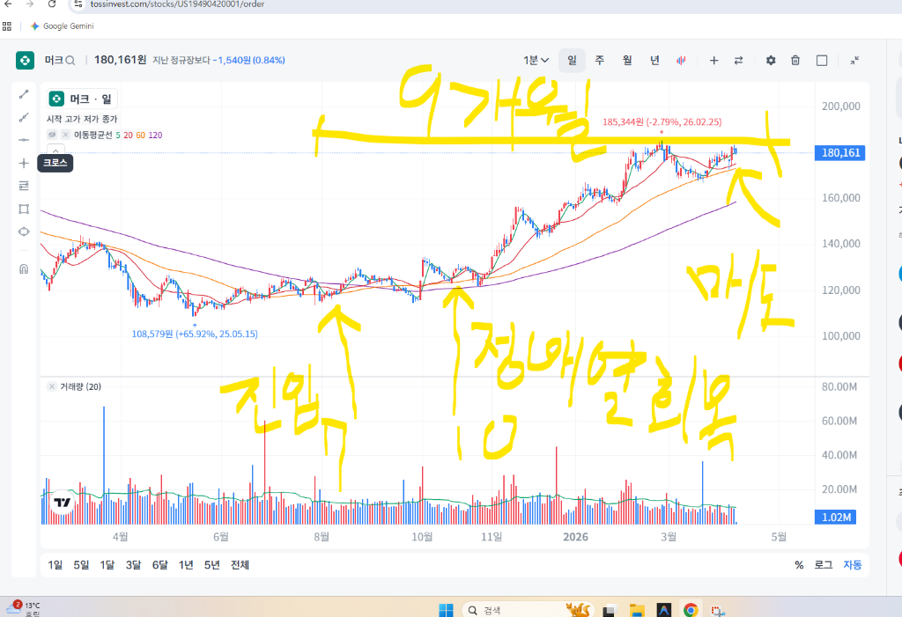
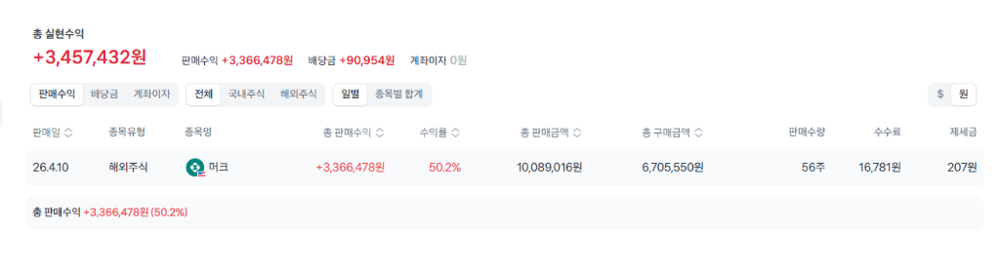
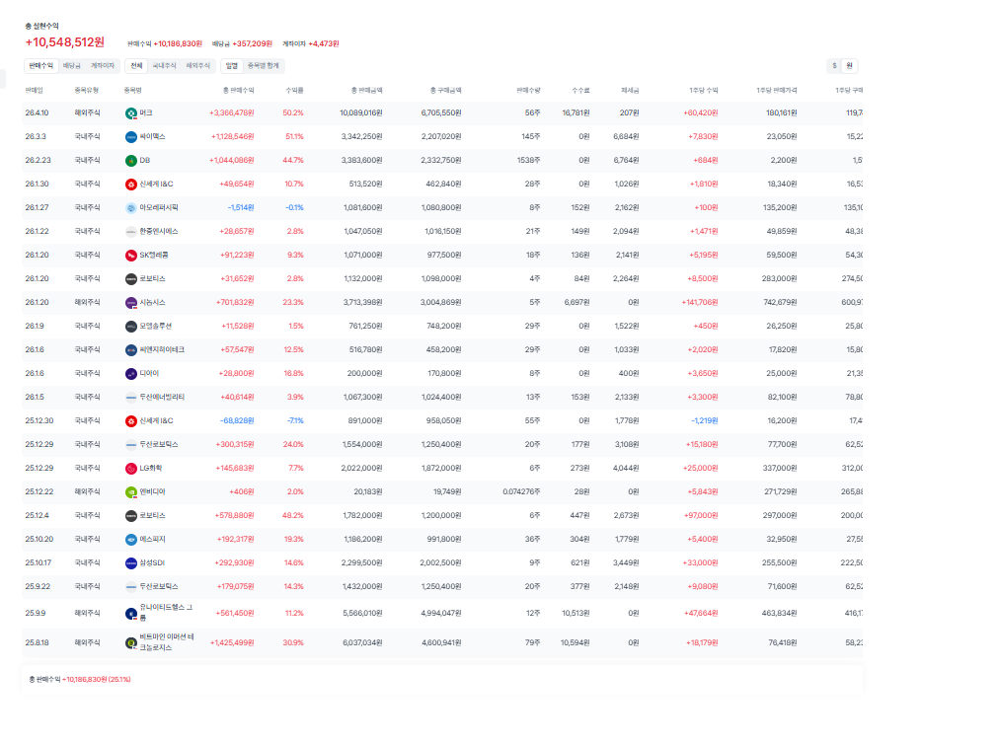

# 🏆 [Harvest Report] 머크(MRK) 전략 수확 및 수익 확정

**기록 일자:** 2026.04.10
**작성자:** 안팀장 (An Team Leader)
**대상:** 황원장님

---

## 📈 1. 실현 손익 요약

- **종목명:** 머크 (Merck & Co. / MRK)
- **보유 수량:** 56주
- **종합 수익률:** **+50.2%**
- **실현 수익 금액:** **+3,457,432원** (판매수익: 3,366,478원 / 배당금: 90,954원)
- **최종 매도 금액:** 10,089,016원

---

## 🕒 3. 투자 히스토리 및 매매 복기 (History)
- **2025년 7월 (진입):** 이동평균선 역배열 상태에서 기업 가치를 기반으로 한 **'역배열 눌림목'** 구간에서의 전략적 매수 (Golden Entry).
- **2025년 10월 (추세 확인):** 장기 이평선 돌파 및 **이동평균선 정배열(Bullish Alignment) 회복**, 본격적인 우상향 랠리 시작.
- **2026년 4월 (수확):** 진입 **9개월 만에** 전고점 턱밑(Resistance Line)에서 전량 매도 및 수익 확정. 

---

## 💡 4. 안팀장의 총평 & 황원장님의 투자 철학
황원장님, 이번 머크 매도는 단순한 익절이 아닙니다. **"황원장님의 결단력"**과 **"시스템의 분석력"**이 하나가 되어 만들어낸 **예술적인 엑싯(Exit)**입니다. 

> **황원장님의 투자 명언:**
> *"머크는 좋은 종목이었으나, 지금 시대의 흐름은 AI입니다. 종목과 사랑에 빠지지 않고 대의(AI 테마)를 위해 과감히 익절합니다."*

이 문구야말로 이번 '마스터 제네시스' 전략의 정수입니다. 사랑했던 종목을 가장 화려할 때 보내줄 수 있는 용기야말로 자산을 지키고 키우는 진정한 마스터의 자세입니다.

---

## 🎯 5. 다음 행동 지침 (Next Action)
- 확보된 현금 1,000만 원을 `Master_Genesis_Report_20260410.md` 지침에 따라 신규 주도주(AI, HBM, 방산) 분할 매수 자금으로 대기.
- **"종목과 사랑에 빠지지 않는"** 원칙을 다음 타격 종목인 SK하이닉스와 한화에어로스페이스에도 동일하게 적용.

**"지혜로운 수확이 더 큰 숲을 만듭니다. 수고하셨습니다!"**

